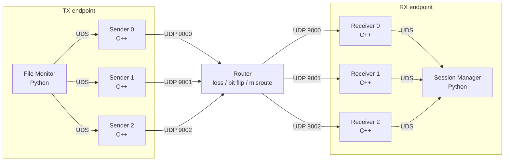

<div align="center">

# Uniflow

### Fault-tolerant, one-way file synchronization over three parallel UDP paths

[](https://github.com/MrFaiman/uniflow/actions/workflows/ci.yml)


**Create, modify, or delete files on TX — Uniflow synchronizes them to RX through a strictly one-way network, even when packets are lost, corrupted, or misrouted.**

</div>

---

## Contents

- [Overview](#overview)
- [Architecture](#architecture)
- [Deployment modes](#deployment-modes)
- [Two physical computers](#two-physical-computers)
- [How transfers work](#how-transfers-work)
- [Fault tolerance](#fault-tolerance)
- [File lifecycle](#file-lifecycle)
- [Configuration](#configuration)
- [Testing](#testing)
- [Development](#development)
- [Repository layout](#repository-layout)
- [Assignment coverage](#assignment-coverage)
- [Troubleshooting](#troubleshooting)
- [Final submission checklist](#final-submission-checklist)

---

# Overview

Uniflow is a **one-way, fault-tolerant file synchronization system** built around three independent UDP paths.

Its main constraint is simple:

> RX cannot send acknowledgements, retransmission requests, or any other network traffic back to TX.

Because a traditional ACK/retry protocol is not available, reliability is handled entirely on the forward path with:

- **RaptorQ forward error correction**
- **per-packet SHA-256 validation**
- **final file SHA-256 validation**
- **3 independent C++ Sender processes**
- **3 independent C++ Receiver processes**
- **Python File Monitor**
- **Python Session Manager**
- **Unix Domain Socket IPC**
- **Protocol Buffers**
- **version-aware create / modify / delete synchronization**
- a **fault-injection router** that can simulate:
  - packet loss
  - bit corruption
  - packet misrouting

The system supports files up to **1 GiB**.

For normal runtime, the host machine only needs **Docker + Docker Compose**. Python, `uv`, `protoc`, CMake, the C++ compiler, Protobuf dependencies, RaptorQ and Python packages are handled inside Docker.

---

# Architecture



Network direction:

```text
TX  ───────────────>  Router  ───────────────>  RX
```

There is deliberately no:

```text
RX  ───────────────>  TX
```

No ACK.  
No NACK.  
No retry request.  
No reverse synchronization channel.

## Process model

### TX endpoint

| Process      | Language | Responsibility                                                                         |
| ------------ | -------- | -------------------------------------------------------------------------------------- |
| File Monitor | Python   | Watches the source tree, detects file lifecycle events, encodes files, schedules paths |
| Sender 0     | C++      | UDS → UDP 9000                                                                         |
| Sender 1     | C++      | UDS → UDP 9001                                                                         |
| Sender 2     | C++      | UDS → UDP 9002                                                                         |

### RX endpoint

| Process         | Language | Responsibility                                                       |
| --------------- | -------- | -------------------------------------------------------------------- |
| Receiver 0      | C++      | UDP 9000 → shared Session Manager UDS                                |
| Receiver 1      | C++      | UDP 9001 → shared Session Manager UDS                                |
| Receiver 2      | C++      | UDP 9002 → shared Session Manager UDS                                |
| Session Manager | Python   | Validates packets, reconstructs files, handles versions and deletion |

This guarantees that each endpoint machine runs both Python and C++ processes.

---

# Deployment modes

Uniflow uses **one `docker-compose.yaml`** and four profiles.

| Profile       | Starts                     | Use case                      |
| ------------- | -------------------------- | ----------------------------- |
| `all`         | TX + simulated Router + RX | Entire system on one computer |
| `tx`          | TX + simulated Router      | PC A in a two-PC test         |
| `rx`          | RX only                    | PC B in a two-PC test         |
| `tx-external` | TX only                    | Real / instructor router      |

## Host requirements

Required:

- Docker Desktop / Docker Engine
- Docker Compose v2

Optional:

- Git, if cloning instead of downloading the repository

On Windows, Docker Desktop should use Linux containers.

---

## Mode 1 — All-in-one on one computer

```text
TX container -> simulated Router container -> RX container
```

Start:

```bash
cd devops
docker compose --profile all up --build
```

The router defaults to:

```text
3% packet loss
3% bit flips
3% misrouting
```

Clean baseline in Bash / Git Bash:

```bash
PACKET_LOSS=0 \
BIT_FLIP=0 \
MISROUTING=0 \
docker compose --profile all up --build
```

PowerShell:

```powershell
$env:PACKET_LOSS="0"
$env:BIT_FLIP="0"
$env:MISROUTING="0"

docker compose --profile all up --build
```

Source directory:

```text
devops/data/out/
```

Destination directory:

```text
devops/data/in/
```

Create:

```bash
echo "hello from Uniflow" > data/out/hello.txt
```

Expected RX log:

```text
COMPLETE: hello.txt - HASH OK
```

Modify:

```bash
echo "updated" > data/out/hello.txt
```

Delete:

```bash
rm data/out/hello.txt
```

Expected RX log:

```text
DELETED: hello.txt
```

Logs:

```bash
docker compose --profile all logs -f tx_machine router rx_machine
```

Processes:

```bash
docker compose --profile all top
```

Stop:

```bash
docker compose --profile all down
```

---

## Mode 2 — TX + simulated router on PC A

Use this mode when testing on two physical computers and you want the bundled fault-injection router to stay on PC A.

```text
PC A
TX -> simulated Router -> real LAN -> PC B / RX
```

Set `RX_HOST` to PC B's LAN IP.

Example:

```text
192.168.1.50
```

Bash / Git Bash:

```bash
cd devops

RX_HOST=192.168.1.50 \
docker compose --profile tx up --build
```

PowerShell:

```powershell
cd devops

$env:RX_HOST="192.168.1.50"

docker compose --profile tx up --build
```

Clean network:

```bash
RX_HOST=192.168.1.50 \
PACKET_LOSS=0 \
BIT_FLIP=0 \
MISROUTING=0 \
docker compose --profile tx up --build
```

Harsh reliability test:

```bash
RX_HOST=192.168.1.50 \
PACKET_LOSS=0.15 \
BIT_FLIP=0.15 \
MISROUTING=0.15 \
UNIFLOW_FEC_REPAIR_PERCENT=50 \
docker compose --profile tx up --build
```

That gives:

```text
15% packet loss
15% bit flips
15% misrouting
50% FEC repair
```

TX continuously watches:

```text
devops/data/out/
```

Stop:

```bash
docker compose --profile tx down
```

---

## Mode 3 — RX only on PC B

Start:

```bash
cd devops
docker compose --profile rx up --build
```

The RX profile publishes:

```text
UDP 9000
UDP 9001
UDP 9002
```

to the physical host.

Completed files appear under:

```text
devops/data/in/
```

Find the RX IP on Windows:

```powershell
ipconfig
```

or Linux:

```bash
ip addr
```

If Windows Firewall blocks the ports, open elevated PowerShell:

```powershell
New-NetFirewallRule `
  -DisplayName "Uniflow UDP 9000-9002" `
  -Direction Inbound `
  -Protocol UDP `
  -LocalPort 9000-9002 `
  -Action Allow
```

View processes:

```bash
docker compose --profile rx top
```

Expected:

```text
Python Session Manager
C++ Receiver 0
C++ Receiver 1
C++ Receiver 2
```

Stop:

```bash
docker compose --profile rx down
```

---

## Mode 4 — TX only with a real / instructor router

The `tx-external` profile starts **TX only**.

It does not start the bundled simulated router.

```text
PC A / TX -> real or instructor router -> PC B / RX
```

Set `ROUTER_HOST` to the router address.

Example:

```text
10.0.0.20
```

Bash / Git Bash:

```bash
ROUTER_HOST=10.0.0.20 \
docker compose --profile tx-external up --build
```

PowerShell:

```powershell
$env:ROUTER_HOST="10.0.0.20"

docker compose --profile tx-external up --build
```

The three Senders target:

```text
ROUTER_HOST:9000
ROUTER_HOST:9001
ROUTER_HOST:9002
```

Stop:

```bash
docker compose --profile tx-external down
```

---

# Two physical computers

Recommended test topology:

```text
PC A                                                PC B

┌─────────────────────────┐                  ┌─────────────────────────┐
│ Python File Monitor     │                  │ C++ Receiver 0          │
│ C++ Sender 0            │                  │ C++ Receiver 1          │
│ C++ Sender 1            │                  │ C++ Receiver 2          │
│ C++ Sender 2            │                  │ Python Session Manager  │
│                         │                  │                         │
│ Simulated Router        │ ───────────────> │ UDP 9000 / 9001 / 9002 │
│ loss / flip / misroute  │      LAN         │                         │
└─────────────────────────┘                  └─────────────────────────┘
```

Always start RX first, because RX cannot request retransmission later.

### PC B

```bash
cd uniflow/devops
docker compose --profile rx up --build
```

Assume PC B is:

```text
192.168.1.50
```

### PC A

```bash
cd uniflow/devops

RX_HOST=192.168.1.50 \
docker compose --profile tx up --build
```

### Create test

PC A:

```bash
echo "hello from two PCs" > data/out/two-pc-test.txt
```

PC B should receive:

```text
data/in/two-pc-test.txt
```

### Modify test

PC A:

```bash
echo "updated over LAN" > data/out/two-pc-test.txt
```

### Delete test

PC A:

```bash
rm data/out/two-pc-test.txt
```

Expected RX log:

```text
DELETED: two-pc-test.txt
```

---

# How transfers work

## Continuous monitoring

The File Monitor recursively watches the TX source tree until the application is stopped.

A file must remain stable across multiple scans before transfer begins.

Default polling interval:

```text
1 second
```

## Small files

Files below the current **10 MiB** threshold use one Sender/Receiver pair.

```text
File A -> Sender 0 -> Receiver 0
File B -> Sender 1 -> Receiver 1
File C -> Sender 2 -> Receiver 2
```

Up to three small files can therefore transfer concurrently.

## Large files

Large files are processed in **1 MiB blocks**.

Each block is RaptorQ-encoded and encoded packets are distributed across all three Sender paths.

```text
Large file
   |
   +--> Sender 0
   +--> Sender 1
   +--> Sender 2
```

The implementation processes a file block-by-block instead of loading an entire 1 GiB file into RAM.

## Protocol Buffers

`proto/transfer.proto` is the shared message schema.

A normal `WRITE` packet contains metadata such as:

- file ID / version
- relative file path
- original file size
- original file SHA-256
- packet index
- block index
- block offset
- RaptorQ symbol data
- target receiver
- packet SHA-256
- operation type

The schema also supports:

```text
DELETE
```

## RX reconstruction

All Receivers forward Protobuf messages to the same Session Manager.

The Session Manager:

1. parses Protobuf
2. validates metadata
3. verifies packet SHA-256
4. rejects corrupted packets
5. groups packets by file and block
6. reconstructs blocks with RaptorQ
7. writes to a temporary partial file
8. verifies final SHA-256
9. atomically publishes the completed file

---

# Fault tolerance

| Problem                | Response                                                                 |
| ---------------------- | ------------------------------------------------------------------------ |
| Packet loss            | RaptorQ repair symbols recover missing data within configured redundancy |
| Bit flip               | Packet SHA-256 fails and the packet is rejected                          |
| Misrouting             | Any Receiver can forward a valid packet to the shared Session Manager    |
| Out-of-order packets   | Reconstruction is metadata-driven, not arrival-order-driven              |
| Duplicate packet       | Duplicate state is ignored                                               |
| Old file version       | Cannot replace a newer version                                           |
| Old DELETE             | Cannot remove a newer version                                            |
| Old WRITE after delete | Tombstone/version logic prevents recreation                              |
| Wrong final bytes      | Final SHA-256 fails and file is not published                            |

There is no retransmission protocol because RX has no reverse network path.

---

# File lifecycle

## Create

```text
TX creates file
      |
      v
RX receives file
```

## Modify

```text
TX modifies file
      |
      v
newer version is transferred
      |
      v
RX replaces previous version
```

## Delete

```text
TX deletes file
      |
      v
DELETE Protobuf message
      |
      v
RX removes file
```

Delete messages are sent through all three Sender paths for additional redundancy.

---

# Configuration

## Router

| Variable             |      Default | Purpose                                 |
| -------------------- | -----------: | --------------------------------------- |
| `RX_HOST`            | `rx_machine` | RX address used by the simulated router |
| `PACKET_LOSS`        |       `0.03` | Drop probability                        |
| `BIT_FLIP`           |       `0.03` | Corruption probability                  |
| `MISROUTING`         |       `0.03` | Wrong-port probability                  |
| `RANDOM_SEED`        |       `1337` | Deterministic random seed               |
| `STATS_INTERVAL_SEC` |         `10` | Router stats interval                   |
| `LOG_PACKETS`        |          `0` | Detailed packet logging                 |

## TX

| Variable                     |      Default | Purpose                   |
| ---------------------------- | -----------: | ------------------------- |
| `ROUTER_HOST`                |     `router` | Router hostname/IP        |
| `UNIFLOW_FEC_REPAIR_PERCENT` |         `20` | RaptorQ repair percentage |
| `UNIFLOW_SEND_RATE_MBPS`     |         `25` | UDP pacing per Sender     |
| `UNIFLOW_WATCH_POLLING`      |        `1.0` | Monitor polling interval  |
| `UNIFLOW_MAX_FILE_BYTES`     | `1073741824` | Maximum file size         |

## Shared endpoint settings

| Variable             |                      Default | Purpose       |
| -------------------- | ---------------------------: | ------------- |
| `PORT`               |                       `9000` | Base UDP port |
| `UNIFLOW_WORKERS`    |                          `3` | Worker count  |
| `IPC_SOCKET_PATH`    |        `/tmp/proto_ipc.sock` | UDS base path |
| `UNIFLOW_NET_BINARY` | `/usr/local/bin/uniflow-net` | C++ runtime   |

Workers use:

```text
9000
9001
9002
```

---

# Testing

From:

```bash
cd devops
```

No faults:

```bash
./run-transfer-test.sh --chaos none
```

Loss:

```bash
./run-transfer-test.sh --chaos loss
```

Bit flips:

```bash
./run-transfer-test.sh --chaos flip
```

Misrouting:

```bash
./run-transfer-test.sh --chaos misroute
```

Mild combined faults:

```bash
./run-transfer-test.sh --chaos mild
```

Harsh faults:

```bash
./run-transfer-test.sh --chaos harsh
```

1 GiB test:

```bash
./run-transfer-test.sh \
  --chaos none \
  --include-1gb \
  --timeout 7200
```

Keep topology running:

```bash
./run-transfer-test.sh \
  --chaos none \
  --keep-running
```

The end-to-end suite verifies multiple file sizes, nested paths, SHA-256, modification, deletion, and optionally 1 GiB transfer.

> The helper test script uses host Bash/Python for fixture generation. The normal Uniflow runtime itself only requires Docker.

---

# Development

These tools are only needed for host-side development.

## Python

```bash
python -m pip install uv
```

If `uv` is not in PATH:

```bash
python -m uv --version
```

## Generate Python Protobuf

With standalone `protoc`:

```bash
bash scripts/generate-proto.sh python
```

Without standalone `protoc`:

```bash
python -m pip install grpcio-tools

python -m grpc_tools.protoc \
  -I proto \
  --python_out=python/client/src/client \
  proto/transfer.proto
```

Do not manually edit generated `transfer_pb2.py`.

## Python tests

```bash
cd python/client

python -m uv sync --all-groups
python -m uv run ruff check src tests
python -m uv run pytest
```

Some native Windows Python builds do not expose `socket.AF_UNIX`.

Check:

```bash
python -c "import socket; print(hasattr(socket, 'AF_UNIX'))"
```

If it prints `False`:

```bash
python -m uv run pytest \
  -k "not unix_socket and not multiple_receivers_use_one_socket"
```

The Linux Docker runtime supports Unix Domain Sockets.

## C++ build

```bash
cmake \
  -S cpp \
  -B cpp/build \
  -DCMAKE_BUILD_TYPE=Release

cmake --build cpp/build --parallel
```

---

# Repository layout

```text
uniflow/
├── .github/
│   └── workflows/
│       └── ci.yml
├── cpp/
│   ├── CMakeLists.txt
│   └── src/
├── devops/
│   ├── docker-compose.yaml
│   ├── uniflow.Dockerfile
│   ├── entrypoint.sh
│   ├── config.py
│   ├── router/
│   ├── scripts/
│   ├── data/
│   │   ├── out/
│   │   └── in/
│   └── run-transfer-test.sh
├── proto/
│   └── transfer.proto
├── python/
│   └── client/
│       ├── pyproject.toml
│       ├── src/client/
│       └── tests/
├── scripts/
│   └── generate-proto.sh
└── README.md
```

Active runtime:

```text
cpp/
python/client/
proto/
devops/
```

---

# Assignment coverage

| Requirement                  | Implementation         |
| ---------------------------- | ---------------------- |
| Two physical endpoints       | `tx` + `rx` profiles   |
| Strict one-way communication | No RX → TX channel     |
| TX File Monitor              | Python                 |
| 3 Senders                    | C++                    |
| 3 Receivers                  | C++                    |
| Separate ports               | UDP 9000 / 9001 / 9002 |
| RX Session Manager           | Python                 |
| Small file on one pair       | Round-robin assignment |
| Concurrent small files       | Up to 3 paths          |
| Large file over all 3 paths  | Distributed routing    |
| Packet loss simulation       | Router                 |
| Bit corruption simulation    | Router                 |
| Misrouting simulation        | Router                 |
| Create monitoring            | Yes                    |
| Modify monitoring            | Yes                    |
| Delete synchronization       | Yes                    |
| Final hash validation        | SHA-256                |
| Up to 1 GiB                  | Yes                    |
| Python on both endpoints     | Yes                    |
| C++ on both endpoints        | Yes                    |
| Unix Domain Socket IPC       | Yes                    |
| Protocol Buffers             | Yes                    |
| Dockerized runtime           | Yes                    |
| External router support      | `tx-external`          |

---

# Troubleshooting

## Runtime dependencies

Check only:

```bash
docker --version
docker compose version
```

Normal execution should not require host Python, `uv`, `protoc`, CMake, or `g++`.

## Router cannot resolve RX

If logs say:

```text
Waiting for RX host ...
```

verify `RX_HOST`.

For two PCs, use PC B's LAN IP.

## RX receives nothing

Check:

1. RX started first
2. correct `RX_HOST`
3. UDP 9000-9002 allowed through PC B firewall
4. both machines can reach each other
5. VPN is not isolating hosts
6. router logs show forwarded traffic
7. Receiver processes are running

## Inspect state

All-in-one:

```bash
docker compose --profile all ps
```

TX side:

```bash
docker compose --profile tx ps
```

RX side:

```bash
docker compose --profile rx ps
```

External router mode:

```bash
docker compose --profile tx-external ps
```

## Deletion does not appear on RX

Rebuild:

```bash
docker compose --profile all down
docker compose --profile all up --build
```

Expected:

```text
DELETED: <relative-path>
```

---

# Final submission checklist

- [ ] All three team members have meaningful commits
- [ ] Final implementation merged into `main`
- [ ] CI is green
- [ ] `--profile all` works
- [ ] Create works
- [ ] Modify works
- [ ] Delete works
- [ ] Zero-fault test passes
- [ ] Packet-loss test passes
- [ ] Bit-flip test passes
- [ ] Misrouting test passes
- [ ] Combined-fault test passes
- [ ] 1 GiB test passes
- [ ] Real two-PC deployment tested
- [ ] PC A runs TX + simulated Router
- [ ] PC B runs RX
- [ ] UDP 9000-9002 cross the LAN
- [ ] Python + C++ visible on both endpoint machines
- [ ] `tx-external` remains available for a real router

---

<div align="center">

## Uniflow

**One direction. Three paths. Reliable reconstruction.**

</div>
